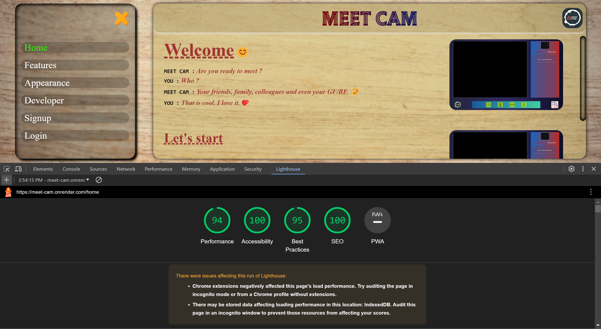
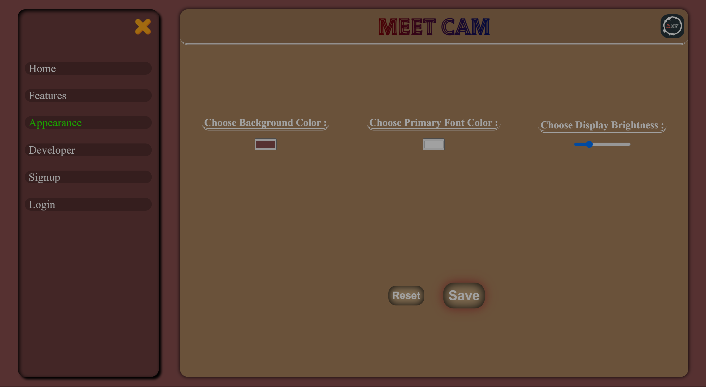
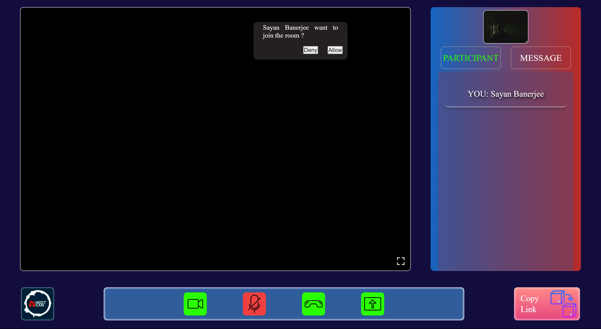
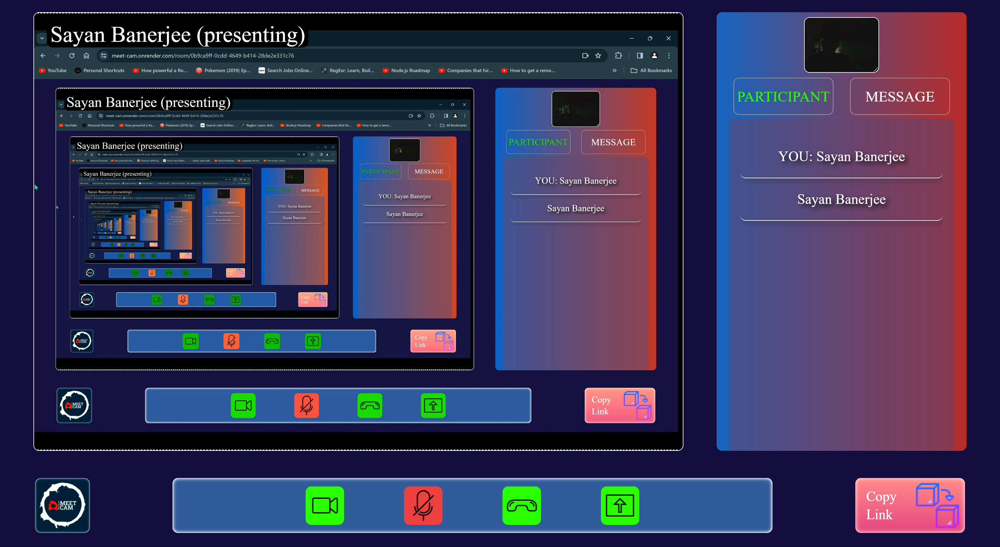

# MEET CAM

A place where you can create a group meeting with your friends. You can do video call, audio call, share screen and also do chat.

## Top features :

1. Authentication
2. Authorization
3. OTP verification using email
4. Live chat
5. CDN hosted background image
6. Responsive Design

## Images :

### Home

### Features

### Appearance

### Developer

### Signup

### Login

### Email Verification

### Video Page Joining Request

### Video Running

### Presenting Screen

### Profile

